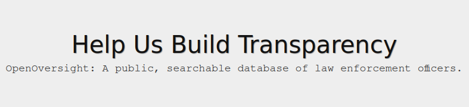

## Hey there, I'm Madison! 💖

I'm an experienced data engineer passionate about open source, automation, and maintainable code.

I'm currently looking for a role as a **Lead or Staff Data Engineer**.

# Projects

## Openverse

[Openverse](https://openverse.org) is a search engine for openly licensed media.
I've been a core committer to the project since 2021, working on all aspects of the
stack including the data pipeline, infrastructure, and community management.

**Repository**: [WordPress/openverse](https://github.com/WordPress/openverse)

## OpenOversight

[SPD.watch](https://spd.watch) is a Seattle-area fork of the [OpenOversight](https://openoversight.com/) platform for tracking police misconduct in the United States. I initially created this fork in 2020 to track Seattle Police Department misconduct, and have since expanded it alongside other contributors to include other local law enforcement agencies.

**Repository**: [OrcaCollective/OpenOversight](https://github.com/OrcaCollective/OpenOversight)

## Other notable contributions
- [Apache Airflow](https://github.com/apache/airflow/commits?author=AetherUnbound)
- [CellProfiler](https://github.com/CellProfiler/CellProfiler/commits?author=AetherUnbound)
- [Numpy](https://github.com/numpy/numpy/commits?author=AetherUnbound)
- [AICSImageIO](https://github.com/AllenCellModeling/aicsimageio/commits?author=AetherUnbound)

# Talks & Podcasts

<!--
**AetherUnbound/aetherunbound** is a ✨ _special_ ✨ repository because its `README.md` (this file) appears on your GitHub profile.

Here are some ideas to get you started:

- 🔭 I’m currently working on ...
- 🌱 I’m currently learning ...
- 👯 I’m looking to collaborate on ...
- 🤔 I’m looking for help with ...
- 💬 Ask me about ...
- 📫 How to reach me: ...
- 😄 Pronouns: ...
- ⚡ Fun fact: ...
-->
